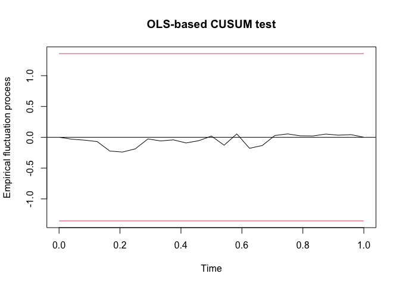
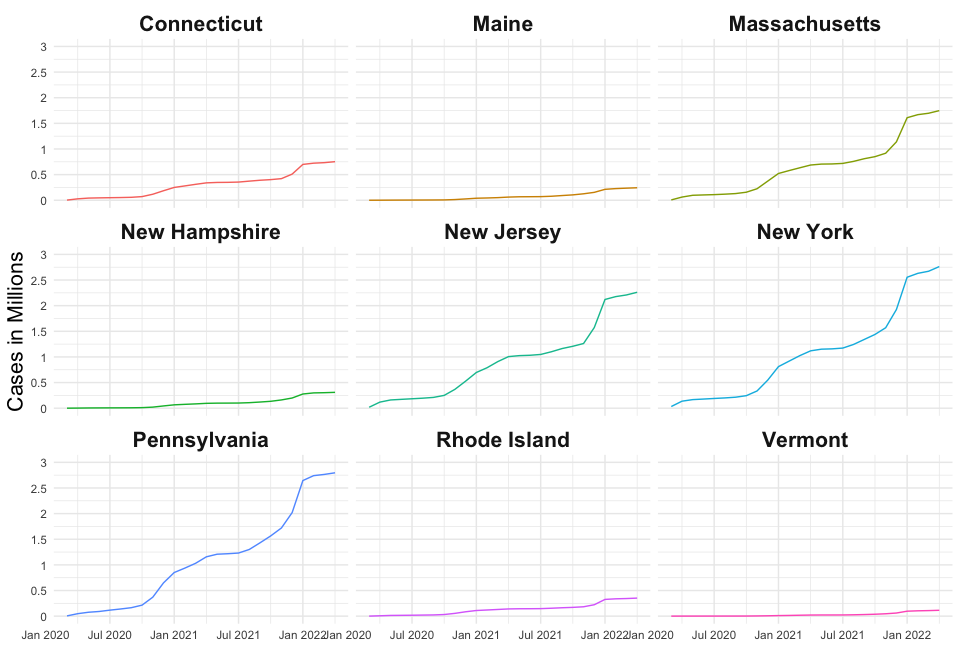

``` r
library(tidyverse)
library(MASS, exclude = "select")
library(here)
library(zoo)
library(vars)
library(tseries)
library(ggplot2)
```

The data is from the
[CDC](https://data.cdc.gov/Case-Surveillance/United-States-COVID-19-Cases-and-Deaths-by-State-o/9mfq-cb36/data).

``` r
df <- read.csv(here("data/United_States_COVID-19_Cases_and_Deaths_by_State_over_Time.csv")) %>%
  select(submission_date, state, new_case)
head(df) 
```

    ##   submission_date state new_case
    ## 1      12/01/2021    ND      589
    ## 2      12/10/2020    WA     3018
    ## 3      08/17/2020    MD      503
    ## 4      03/28/2022    VT      467
    ## 5      03/18/2020    ME       12
    ## 6      02/06/2020    NE        0

For simplicity, start with a subset of northeastern states, with counts
by month starting in March 2020. We will look at Covid cases instead of
deaths.

``` r
# make table of states/regions
states <- data.frame(state.name, state.region, state.abb)
northeast_states_df <- states %>%
  filter(state.region == "Northeast")
northeast_states <- northeast_states_df %>%
  select(state.name) %>%
  rename("state" = "state.name") %>%
  pull(state)

# make northeast df
northeast_df <- df %>%
  # select northeast states only
  merge(northeast_states_df, by.x = "state", by.y = "state.abb", all.x = F) %>%
  select(submission_date, new_case, state.name) %>%
  rename("state" = "state.name", "date" = "submission_date", "cases" = "new_case") %>%
  mutate(month = substr(date, 1, 2), 
         year = substr(date, 7, 10), 
         date_ym = as.yearmon(paste(month, year, sep ="-"), format = "%m-%Y") ) %>%
  select(state, cases, date_ym) %>%
  group_by(date_ym, state) %>%
  # calculate cases by month
  summarize(cases = sum(cases), .groups = "drop") %>%
  pivot_wider(names_from = state, values_from = cases) 

# massachusets is only state to record in feb 2020, 
# so start in March 2020
northeast_df <- northeast_df[-c(1:2), ]
```

Next we convert to a time series object.

``` r
# make each individual state a time series
ts_list <- lapply(X = setNames(northeast_states, northeast_states), FUN =  function(x) {
  state_ts <- ts(northeast_df[[x]],
        start = c(2020, 3), 
        end = c(2022, 4), 
        frequency = 12)
  state_ts
})

# merge time series together into one time series object/matrix
var_data <- do.call(ts.union, ts_list)
```

Next we calculate a correlation between states. I get errors later about
singularity and positive definite. So, I calculate the correlation
matrix and take the determinant, and find that it is treated as zero by
machine precision.

``` r
cor_matrix <- round(cor(var_data), 3)
cor_matrix
```

    ##               Connecticut Maine Massachusetts New Hampshire New Jersey New York
    ## Connecticut         1.000 0.901         0.992         0.937      0.989    0.978
    ## Maine               0.901 1.000         0.934         0.984      0.901    0.932
    ## Massachusetts       0.992 0.934         1.000         0.961      0.985    0.989
    ## New Hampshire       0.937 0.984         0.961         1.000      0.927    0.957
    ## New Jersey          0.989 0.901         0.985         0.927      1.000    0.981
    ## New York            0.978 0.932         0.989         0.957      0.981    1.000
    ## Pennsylvania        0.968 0.941         0.971         0.968      0.952    0.967
    ## Rhode Island        0.989 0.924         0.989         0.950      0.973    0.962
    ## Vermont             0.891 0.978         0.928         0.959      0.899    0.913
    ##               Pennsylvania Rhode Island Vermont
    ## Connecticut          0.968        0.989   0.891
    ## Maine                0.941        0.924   0.978
    ## Massachusetts        0.971        0.989   0.928
    ## New Hampshire        0.968        0.950   0.959
    ## New Jersey           0.952        0.973   0.899
    ## New York             0.967        0.962   0.913
    ## Pennsylvania         1.000        0.969   0.899
    ## Rhode Island         0.969        1.000   0.925
    ## Vermont              0.899        0.925   1.000

``` r
# I think this is the problem -> 0 with machine precision
print(paste("The determinant is:", det(cor_matrix)))
```

    ## [1] "The determinant is: 5.4512722574876e-15"

I use `VARselect` to see the information criteria for different lags.
All agree that the lag should be 2.

``` r
VARselect(var_data)
```

    ## $selection
    ## AIC(n)  HQ(n)  SC(n) FPE(n) 
    ##      2      2      2      2 
    ## 
    ## $criteria
    ##                   1    2    3    4    5    6    7    8    9   10
    ## AIC(n) 5.465922e+01 -Inf -Inf -Inf -Inf -Inf -Inf -Inf -Inf -Inf
    ## HQ(n)  5.488176e+01 -Inf -Inf -Inf -Inf -Inf -Inf -Inf -Inf -Inf
    ## SC(n)  5.900503e+01 -Inf -Inf -Inf -Inf -Inf -Inf -Inf -Inf -Inf
    ## FPE(n) 3.835143e+24    0    0    0    0    0    0    0    0    0

VAR does the estimation of VAR with OLS.

``` r
var_est <- VAR(y = var_data, p = 2)

# coefficients for each equation
coefficients <- coef(var_est) %>%
  lapply(as.data.frame) 

# Connecticut example
summary(var_est$varresult$Connecticut)
```

    ## 
    ## Call:
    ## lm(formula = y ~ -1 + ., data = datamat)
    ## 
    ## Residuals:
    ##        1        2        3        4        5        6        7        8 
    ##  -1945.3  -1027.5  -1476.4  -9836.2  -1036.9   3293.3  10316.6  -2088.1 
    ##        9       10       11       12       13       14       15       16 
    ##   1131.5  -3217.4   2338.1   4772.1  -9419.1  11707.5 -14930.2   2864.9 
    ##       17       18       19       20       21       22       23       24 
    ##  10408.6   1647.0  -2004.7   -124.9   1956.0  -1107.0    516.7  -2738.6 
    ## 
    ## Coefficients:
    ##                    Estimate Std. Error t value Pr(>|t|)  
    ## Connecticut.l1    5.337e-02  4.571e+00   0.012   0.9911  
    ## Maine.l1         -3.442e+00  5.209e+00  -0.661   0.5379  
    ## Massachusetts.l1 -3.697e-01  1.975e+00  -0.187   0.8589  
    ## New.Hampshire.l1  1.261e+01  4.156e+00   3.034   0.0289 *
    ## New.Jersey.l1     8.066e-01  6.791e-01   1.188   0.2883  
    ## New.York.l1      -6.219e-01  1.276e+00  -0.487   0.6466  
    ## Pennsylvania.l1   1.450e-01  7.141e-01   0.203   0.8471  
    ## Rhode.Island.l1  -2.913e-02  1.059e+01  -0.003   0.9979  
    ## Vermont.l1       -2.016e+01  9.759e+00  -2.065   0.0938 .
    ## Connecticut.l2   -1.743e-01  3.850e+00  -0.045   0.9656  
    ## Maine.l2          9.450e-01  4.422e+00   0.214   0.8392  
    ## Massachusetts.l2  1.771e+00  2.395e+00   0.739   0.4930  
    ## New.Hampshire.l2  3.605e+00  5.159e+00   0.699   0.5159  
    ## New.Jersey.l2    -5.626e-01  9.702e-01  -0.580   0.5871  
    ## New.York.l2      -3.129e-01  7.490e-01  -0.418   0.6935  
    ## Pennsylvania.l2  -1.695e-01  6.174e-01  -0.274   0.7947  
    ## Rhode.Island.l2  -7.503e+00  1.140e+01  -0.658   0.5397  
    ## Vermont.l2        5.108e+00  1.612e+01   0.317   0.7641  
    ## const             1.533e+04  6.570e+03   2.334   0.0669 .
    ## ---
    ## Signif. codes:  0 '***' 0.001 '**' 0.01 '*' 0.05 '.' 0.1 ' ' 1
    ## 
    ## Residual standard error: 13050 on 5 degrees of freedom
    ## Multiple R-squared:  0.9776, Adjusted R-squared:  0.8972 
    ## F-statistic: 12.15 on 18 and 5 DF,  p-value: 0.005835

I should be able to run the following to get a summary for the entire
VAR model, but in this dataset, I get an error that says the system in
singular:

*Error in solve.default(Sigma) : system is computationally singular:
reciprocal condition number = 1.44378e-19*

It should give output like this:

*VAR Estimation Results:*

*=========================*

*Endogenous variables: real_gdp_growth, psei, bsp_rrp, unem*

*Deterministic variables: const*

*Sample size: 78*

*Log Likelihood: -876.81*

*Roots of the characteristic polynomial:*

*0.9776 0.8784 0.56 0.501 0.501 0.1641 0.1525 0.1525*

*Call:*

*VAR(y = v1, p = 2, type = “const”, exogen = NULL)*

``` r
#can't run this due to singuilarity
summary(var_est)
```

Next we run Phillips-Perron Unit Root Test, which tests the stationarity
assumption. The results of the test suggest that the data is
non-stationary, if we hold significance at the 0.05 level, and there is
a trend (this makes sense because of the upward covid cases trend).

``` r
pp_test <- lapply(ts_list, pp.test)

lapply(pp_test, "[[", "p.value") %>%
  as.data.frame() %>%
  pivot_longer(everything(), names_to = c("state"), values_to = "p.value") %>%
  mutate(p.value = round(p.value, 3))
```

    ## # A tibble: 9 × 2
    ##   state         p.value
    ##   <chr>           <dbl>
    ## 1 Connecticut     0.082
    ## 2 Maine           0.068
    ## 3 Massachusetts   0.074
    ## 4 New.Hampshire   0.149
    ## 5 New.Jersey      0.085
    ## 6 New.York        0.094
    ## 7 Pennsylvania    0.094
    ## 8 Rhode.Island    0.048
    ## 9 Vermont         0.048

The stability function checks for structural breaks. Structural breaks
may impact the estimation. The line in the middle of the plot should not
go outside of the red bounds.

``` r
stability <- stability(var_est, type = "OLS-CUSUM")

# connecticut for example
stability$stability$Connecticut
```

    ## 
    ## Empirical Fluctuation Process: OLS-based CUSUM test 
    ## 
    ## Call: efp(formula = formula, data = data, type = type, h = h, dynamic = dynamic, 
    ##     rescale = rescale)

``` r
plot(stability$stability$Connecticut)
```



There are additional functions we cannot run due to singularity.

`serial.test()` computes the multivariate Portmanteau- and
Breusch-Godfrey test for serially correlated errors. This checks the
assumption that the residuals should be non-autocorrelated.

`arch.test()` this computes the ARCH(autoregressive conditionally
heteroscedastic)-LM test, which analyzes volatility variance.

`causality()` computes Granger- and Instantaneous causality. Granger
causality tests if one time series is useful for forecasting another.

``` r
serial.test(var_est, type = "PT.asymptotic")

arch.test(var_est, 
          lags.multi = 15, 
          multivariate.only = TRUE)

causality(var_est, cause = "Connecticut")
```

There are additional functions we cannot run due to not positive
definite. This is the error:

*the leading minor of order 6 is not positive definite for normality
test*

`normality.test()` checks for normality of the distribution of the
residuals.

`irf()` computes the impulse response coefficients. It is not clear to
my why we would need this.

`fevd()` computes the forecast error variance decomposition. It tells
which states influence the variance the most over time.

``` r
normality.test(var_est, multivariate.only = TRUE)

irf(var_est, impulse = "Connecticut", response = "Maine", n.ahead = 20, boot = TRUE)

fevd(var_est)
```

This is a plot of cumulative COVID cases over time.

``` r
northeast_df %>%
  pivot_longer(cols = !date_ym, names_to = "state") %>%
  group_by(state) %>%
  mutate(cum_sum = cumsum(value)) %>%
  ggplot() +
  geom_line(aes(x = date_ym, y = cum_sum,  color = state)) +
  scale_y_continuous(breaks = seq(0, 3000000, 500000),
                     labels = seq(0, 3000000, 500000)/1000000, 
                     limits = c(0, 3000000))+
  labs(x= "", y = "Cases in Millions") + 
  facet_wrap(~state) +
  theme_minimal() +
    theme(legend.position = "none", 
        strip.text = element_text(size = 16, face = "bold"), 
        axis.title = element_text(size = 16)) 
```


