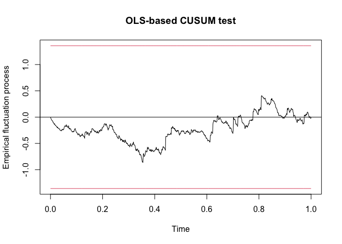

``` r
library(tidyverse)
library(MASS, exclude = "select")
library(here)
library(zoo)
library(vars)
library(tseries)
library(ggplot2)
library(lubridate)
```

The data is from the
[CDC](https://data.cdc.gov/Case-Surveillance/United-States-COVID-19-Cases-and-Deaths-by-State-o/9mfq-cb36/data).

NYC is tabulated on its own. Also, the US territories are included.

``` r
df <- read.csv(here("data/United_States_COVID-19_Cases_and_Deaths_by_State_over_Time.csv")) %>%
  select(submission_date, state, new_case) %>%
  mutate(date = mdy(submission_date)) %>%
  select(date, state, cases = new_case) %>%
  pivot_wider(names_from = state, values_from = cases) 

head(df) 
```

    ## # A tibble: 6 × 61
    ##   date          ND    WA    MD    VT    ME    NE    DE    WI    GU    MI    CT
    ##   <date>     <int> <int> <int> <int> <int> <int> <int> <int> <int> <int> <int>
    ## 1 2021-12-01   589  2242  1142   436  1240  1305   573  5446    13 10697  1093
    ## 2 2020-12-10   506  3018  3202   124   471  1647   646  4709     0  3828  2431
    ## 3 2020-08-17   135   364   503    11    20   162    90   469    19  1621   370
    ## 4 2022-03-28    33   563   489   467   452   647    31   891    59  1448  1014
    ## 5 2020-03-18     2   161    28     2    12     4     4    18     3   964    28
    ## 6 2020-02-06     0     0     0     0     0     0     0     0     0     0     0
    ## # … with 49 more variables: NV <int>, IN <int>, ID <int>, MO <int>, MT <int>,
    ## #   IL <int>, MS <int>, AL <int>, CA <int>, NC <int>, NH <int>, VI <int>,
    ## #   OR <int>, FSM <int>, SC <int>, NJ <int>, DC <int>, MN <int>, KY <int>,
    ## #   AZ <int>, RI <int>, LA <int>, VA <int>, WY <int>, KS <int>, AS <int>,
    ## #   AR <int>, MP <int>, PW <int>, UT <int>, HI <int>, AK <int>, FL <int>,
    ## #   GA <int>, OK <int>, NYC <int>, CO <int>, TX <int>, PR <int>, MA <int>,
    ## #   WV <int>, TN <int>, PA <int>, IA <int>, OH <int>, RMI <int>, SD <int>, …

Next we convert to a time series object.

``` r
# make each individual state a time series
ts_list <- lapply(X = setNames(colnames(df)[-1],colnames(df)[-1]), FUN =  function(x) {
  state_ts <- ts(df[[x]],
        frequency = 1)
  state_ts
})

# merge time series together into one time series object/matrix
var_data <- do.call(ts.union, ts_list)
```

I use `VARselect` to see the information criteria for different lags. I
choose 4.

``` r
VARselect(var_data)
```

    ## $selection
    ## AIC(n)  HQ(n)  SC(n) FPE(n) 
    ##     10      4      4      1 
    ## 
    ## $criteria
    ##          1   2   3        4        5        6        7        8        9
    ## AIC(n) Inf Inf Inf 739.7128 741.1131 741.8118 739.9332 738.6592 733.2099
    ## HQ(n)  Inf Inf Inf 771.6752 781.0330 789.6891 795.7679 802.4513 804.9595
    ## SC(n)  Inf Inf Inf 822.9974 845.1325 866.5660 885.4221 904.8828 920.1683
    ## FPE(n) Inf Inf Inf      Inf      Inf      Inf      Inf      Inf      Inf
    ##              10
    ## AIC(n) 723.6974
    ## HQ(n)  803.4045
    ## SC(n)  931.3906
    ## FPE(n)      Inf

VAR does the estimation of VAR with OLS.

``` r
var_est <- VAR(y = var_data, p = 4)

# coefficients for each equation, CA example
summary <- summary(var_est)
summary$varresult$CA
```

    ## 
    ## Call:
    ## lm(formula = y ~ -1 + ., data = datamat)
    ## 
    ## Residuals:
    ##    Min     1Q Median     3Q    Max 
    ## -49904 -10792  -2957   6899 197628 
    ## 
    ## Coefficients:
    ##          Estimate Std. Error t value Pr(>|t|)    
    ## ND.l1  -3.412e+00  5.927e+00  -0.576 0.565062    
    ## WA.l1  -1.978e+00  1.544e+00  -1.281 0.200756    
    ## MD.l1   1.348e+00  2.492e+00   0.541 0.588717    
    ## VT.l1  -9.361e+00  7.911e+00  -1.183 0.237172    
    ## ME.l1  -9.882e+00  8.826e+00  -1.120 0.263344    
    ## NE.l1  -7.877e-01  3.394e+00  -0.232 0.816543    
    ## DE.l1  -1.621e+01  9.576e+00  -1.693 0.091002 .  
    ## WI.l1  -8.193e-01  1.018e+00  -0.805 0.421377    
    ## GU.l1   4.160e+00  2.039e+01   0.204 0.838383    
    ## MI.l1   7.069e-01  7.193e-01   0.983 0.326134    
    ## CT.l1  -1.287e+00  1.525e+00  -0.844 0.399210    
    ## NV.l1  -2.940e-01  3.759e+00  -0.078 0.937689    
    ## IN.l1   5.184e-01  1.592e+00   0.326 0.744808    
    ## ID.l1   6.303e+00  4.402e+00   1.432 0.152715    
    ## MO.l1  -9.209e-01  1.078e+00  -0.854 0.393305    
    ## MT.l1   2.708e+00  6.215e+00   0.436 0.663192    
    ## IL.l1   1.333e+00  8.770e-01   1.520 0.128949    
    ## MS.l1   3.407e-01  2.909e+00   0.117 0.906781    
    ## AL.l1  -5.331e-01  1.895e+00  -0.281 0.778537    
    ## CA.l1   3.044e-01  1.620e-01   1.879 0.060726 .  
    ## NC.l1  -9.371e-01  1.633e+00  -0.574 0.566273    
    ## NH.l1  -1.077e+01  4.849e+00  -2.221 0.026704 *  
    ## VI.l1   5.280e+01  4.955e+01   1.066 0.287062    
    ## OR.l1   2.789e+00  3.675e+00   0.759 0.448162    
    ## FSM.l1 -2.010e+04  1.469e+04  -1.368 0.171838    
    ## SC.l1   3.197e+00  1.829e+00   1.749 0.080892 .  
    ## NJ.l1  -1.090e+00  1.479e+00  -0.737 0.461340    
    ## DC.l1   4.785e+00  5.136e+00   0.932 0.351917    
    ## MN.l1  -5.979e-02  9.076e-01  -0.066 0.947492    
    ## KY.l1   3.598e+00  2.688e+00   1.338 0.181268    
    ## AZ.l1   2.050e-01  8.357e-01   0.245 0.806340    
    ## RI.l1   1.189e-01  7.496e+00   0.016 0.987355    
    ## LA.l1  -3.201e+00  1.381e+00  -2.319 0.020754 *  
    ## VA.l1   4.396e-01  1.654e+00   0.266 0.790502    
    ## WY.l1   1.346e+01  1.088e+01   1.237 0.216656    
    ## KS.l1   1.587e+00  1.069e+00   1.484 0.138231    
    ## AS.l1   4.376e+01  1.933e+01   2.264 0.023918 *  
    ## AR.l1   2.721e+00  2.833e+00   0.960 0.337207    
    ## MP.l1   6.932e+01  3.788e+01   1.830 0.067780 .  
    ## PW.l1  -3.549e+01  5.577e+01  -0.636 0.524805    
    ## UT.l1   1.122e+00  3.059e+00   0.367 0.713968    
    ## HI.l1  -8.265e-01  5.586e+00  -0.148 0.882438    
    ## AK.l1  -1.027e+01  4.303e+00  -2.387 0.017291 *  
    ## FL.l1   7.095e-01  4.280e-01   1.658 0.097938 .  
    ## GA.l1  -3.169e+00  1.159e+00  -2.733 0.006465 ** 
    ## OK.l1  -7.866e-01  2.206e+00  -0.357 0.721522    
    ## NYC.l1  1.191e-01  3.265e-01   0.365 0.715475    
    ## CO.l1  -6.212e-01  2.155e+00  -0.288 0.773201    
    ## TX.l1  -3.485e-01  3.406e-01  -1.023 0.306588    
    ## PR.l1   8.677e-01  1.193e+00   0.727 0.467403    
    ## MA.l1   1.575e+00  1.361e+00   1.157 0.247727    
    ## WV.l1   1.281e+00  4.231e+00   0.303 0.762267    
    ## TN.l1  -2.592e-01  1.068e+00  -0.243 0.808228    
    ## PA.l1  -4.637e-01  1.062e+00  -0.437 0.662508    
    ## IA.l1   4.953e-01  1.807e+00   0.274 0.784058    
    ## OH.l1  -8.301e-03  6.055e-01  -0.014 0.989066    
    ## RMI.l1  5.398e+02  3.201e+03   0.169 0.866141    
    ## SD.l1  -6.289e+00  7.072e+00  -0.889 0.374270    
    ## NM.l1  -1.903e+00  4.253e+00  -0.447 0.654786    
    ## NY.l1   6.538e-01  1.125e+00   0.581 0.561523    
    ## ND.l2  -9.428e-01  6.052e+00  -0.156 0.876261    
    ## WA.l2   1.513e-01  1.518e+00   0.100 0.920631    
    ## MD.l2   8.252e-01  2.445e+00   0.338 0.735841    
    ## VT.l2   4.364e+00  7.743e+00   0.564 0.573304    
    ## ME.l2   5.362e+00  8.773e+00   0.611 0.541328    
    ## NE.l2   5.129e+00  3.493e+00   1.468 0.142553    
    ## DE.l2  -2.393e+00  9.551e+00  -0.251 0.802232    
    ## WI.l2  -1.274e+00  9.686e-01  -1.315 0.189085    
    ## GU.l2  -1.076e+01  2.069e+01  -0.520 0.603207    
    ## MI.l2   1.829e-01  7.234e-01   0.253 0.800487    
    ## CT.l2   7.368e-01  1.539e+00   0.479 0.632348    
    ## NV.l2  -4.277e+00  3.768e+00  -1.135 0.256858    
    ## IN.l2   1.061e+00  1.601e+00   0.663 0.507782    
    ## ID.l2  -1.829e+00  4.371e+00  -0.418 0.675775    
    ## MO.l2   2.114e+00  1.215e+00   1.740 0.082432 .  
    ## MT.l2   2.664e+00  6.090e+00   0.437 0.661920    
    ## IL.l2  -4.864e-01  8.647e-01  -0.562 0.573994    
    ## MS.l2  -1.145e+00  2.909e+00  -0.393 0.694113    
    ## AL.l2  -1.445e+00  1.892e+00  -0.764 0.445281    
    ## CA.l2   6.654e-02  1.618e-01   0.411 0.681094    
    ## NC.l2   1.931e+00  1.560e+00   1.237 0.216440    
    ## NH.l2  -6.297e+00  4.811e+00  -1.309 0.191102    
    ## VI.l2   2.270e+01  4.994e+01   0.455 0.649590    
    ## OR.l2   3.159e-01  3.680e+00   0.086 0.931630    
    ## FSM.l2 -7.338e+03  1.104e+04  -0.665 0.506573    
    ## SC.l2  -5.311e-02  1.792e+00  -0.030 0.976361    
    ## NJ.l2   6.807e-01  1.425e+00   0.478 0.632958    
    ## DC.l2   2.238e+00  4.837e+00   0.463 0.643706    
    ## MN.l2  -4.580e-01  8.909e-01  -0.514 0.607415    
    ## KY.l2   2.722e+00  2.684e+00   1.014 0.310861    
    ## AZ.l2   1.088e+00  8.302e-01   1.310 0.190580    
    ## RI.l2  -1.157e+01  7.372e+00  -1.570 0.117010    
    ## LA.l2  -1.138e+00  1.347e+00  -0.845 0.398710    
    ## VA.l2   9.830e-01  1.646e+00   0.597 0.550714    
    ## WY.l2  -1.123e+01  1.090e+01  -1.030 0.303232    
    ## KS.l2  -2.841e-01  1.103e+00  -0.258 0.796800    
    ## AS.l2  -5.812e+00  2.071e+01  -0.281 0.779098    
    ## AR.l2  -6.396e+00  2.766e+00  -2.313 0.021094 *  
    ## MP.l2   3.555e+01  3.849e+01   0.924 0.356017    
    ## PW.l2  -4.490e+01  5.579e+01  -0.805 0.421283    
    ## UT.l2   5.645e+00  3.010e+00   1.876 0.061190 .  
    ## HI.l2  -1.130e+00  5.495e+00  -0.206 0.837110    
    ## AK.l2   3.206e+00  4.421e+00   0.725 0.468615    
    ## FL.l2   4.207e-01  4.223e-01   0.996 0.319635    
    ## GA.l2  -1.080e+00  1.150e+00  -0.939 0.348138    
    ## OK.l2   4.448e-01  2.166e+00   0.205 0.837371    
    ## NYC.l2 -1.411e-01  3.232e-01  -0.437 0.662496    
    ## CO.l2  -2.437e+00  2.101e+00  -1.160 0.246699    
    ## TX.l2  -1.055e-01  3.315e-01  -0.318 0.750368    
    ## PR.l2  -4.780e-02  1.179e+00  -0.041 0.967683    
    ## MA.l2  -2.373e-01  1.344e+00  -0.177 0.859962    
    ## WV.l2  -5.687e+00  4.252e+00  -1.337 0.181600    
    ## TN.l2  -9.222e-02  1.019e+00  -0.091 0.927888    
    ## PA.l2   8.294e-02  1.065e+00   0.078 0.937932    
    ## IA.l2   2.615e-01  1.787e+00   0.146 0.883708    
    ## OH.l2   6.472e-01  6.024e-01   1.074 0.283102    
    ## RMI.l2 -1.762e+03  3.277e+03  -0.538 0.591014    
    ## SD.l2   6.829e+00  7.066e+00   0.966 0.334211    
    ## NM.l2  -3.214e+00  4.215e+00  -0.763 0.446038    
    ## NY.l2  -4.218e-01  1.131e+00  -0.373 0.709412    
    ## ND.l3  -1.551e+01  6.039e+00  -2.568 0.010465 *  
    ## WA.l3  -1.389e+00  1.561e+00  -0.890 0.373802    
    ## MD.l3   3.423e+00  2.464e+00   1.389 0.165214    
    ## VT.l3   5.716e+00  7.910e+00   0.723 0.470251    
    ## ME.l3   5.400e+00  8.904e+00   0.606 0.544453    
    ## NE.l3  -1.179e+00  3.544e+00  -0.333 0.739529    
    ## DE.l3  -2.889e+01  9.633e+00  -2.999 0.002822 ** 
    ## WI.l3  -2.524e+00  9.646e-01  -2.617 0.009101 ** 
    ## GU.l3   3.400e+01  2.129e+01   1.597 0.110887    
    ## MI.l3  -5.671e-02  7.409e-01  -0.077 0.939009    
    ## CT.l3  -3.892e+00  1.523e+00  -2.555 0.010865 *  
    ## NV.l3   6.012e+00  3.792e+00   1.585 0.113442    
    ## IN.l3   2.606e+00  1.591e+00   1.638 0.101975    
    ## ID.l3   8.825e+00  4.338e+00   2.034 0.042386 *  
    ## MO.l3   1.593e+00  1.206e+00   1.321 0.186913    
    ## MT.l3  -5.271e+00  6.124e+00  -0.861 0.389790    
    ## IL.l3  -3.442e-01  8.597e-01  -0.400 0.689023    
    ## MS.l3   1.082e+00  2.846e+00   0.380 0.703901    
    ## AL.l3  -1.638e+00  1.869e+00  -0.876 0.381337    
    ## CA.l3   9.897e-02  1.608e-01   0.615 0.538545    
    ## NC.l3   1.794e+00  1.515e+00   1.184 0.236808    
    ## NH.l3   2.453e+00  4.913e+00   0.499 0.617824    
    ## VI.l3   2.552e+01  4.940e+01   0.517 0.605647    
    ## OR.l3  -5.212e+00  3.725e+00  -1.399 0.162236    
    ## FSM.l3 -5.350e+03  1.205e+04  -0.444 0.657149    
    ## SC.l3   3.590e+00  1.808e+00   1.986 0.047538 *  
    ## NJ.l3  -5.466e-01  1.398e+00  -0.391 0.695862    
    ## DC.l3  -2.520e+00  4.864e+00  -0.518 0.604602    
    ## MN.l3  -1.362e+00  9.030e-01  -1.508 0.132115    
    ## KY.l3  -2.527e-01  2.722e+00  -0.093 0.926050    
    ## AZ.l3   5.802e-01  8.273e-01   0.701 0.483374    
    ## RI.l3  -1.237e+01  7.318e+00  -1.690 0.091547 .  
    ## LA.l3  -4.541e+00  1.320e+00  -3.440 0.000624 ***
    ## VA.l3   5.073e+00  1.693e+00   2.997 0.002846 ** 
    ## WY.l3   1.073e+01  1.081e+01   0.993 0.321139    
    ## KS.l3  -1.259e-01  1.076e+00  -0.117 0.906855    
    ## AS.l3  -4.455e+00  2.614e+01  -0.170 0.864725    
    ## AR.l3   1.192e+00  2.731e+00   0.436 0.662821    
    ## MP.l3  -3.423e+01  4.029e+01  -0.850 0.395814    
    ## PW.l3  -4.671e+01  5.759e+01  -0.811 0.417571    
    ## UT.l3  -7.332e+00  2.988e+00  -2.454 0.014419 *  
    ## HI.l3  -2.502e-01  5.684e+00  -0.044 0.964902    
    ## AK.l3  -3.850e+00  4.382e+00  -0.879 0.379971    
    ## FL.l3   4.482e-01  4.211e-01   1.064 0.287581    
    ## GA.l3  -1.436e+00  1.193e+00  -1.204 0.229174    
    ## OK.l3   2.149e+00  2.158e+00   0.996 0.319806    
    ## NYC.l3  2.320e-01  3.046e-01   0.762 0.446598    
    ## CO.l3   4.564e+00  2.058e+00   2.218 0.026960 *  
    ## TX.l3  -6.414e-04  3.365e-01  -0.002 0.998480    
    ## PR.l3   8.067e-01  1.161e+00   0.695 0.487466    
    ## MA.l3   2.302e+00  1.313e+00   1.754 0.079990 .  
    ## WV.l3  -8.429e+00  4.408e+00  -1.912 0.056331 .  
    ## TN.l3  -3.111e+00  1.002e+00  -3.104 0.002004 ** 
    ## PA.l3  -1.008e-01  1.025e+00  -0.098 0.921668    
    ## IA.l3   2.311e+00  1.818e+00   1.271 0.204234    
    ## OH.l3  -1.327e-01  5.705e-01  -0.233 0.816128    
    ## RMI.l3  6.504e+02  3.151e+03   0.206 0.836519    
    ## SD.l3   1.415e+01  7.092e+00   1.996 0.046432 *  
    ## NM.l3   1.906e+00  4.291e+00   0.444 0.657098    
    ## NY.l3  -3.938e-01  1.103e+00  -0.357 0.721220    
    ## ND.l4   1.413e+00  5.994e+00   0.236 0.813718    
    ## WA.l4  -6.277e-01  1.583e+00  -0.396 0.691944    
    ## MD.l4   1.617e+00  2.452e+00   0.659 0.509984    
    ## VT.l4  -1.132e+01  8.024e+00  -1.411 0.158782    
    ## ME.l4  -1.565e+00  8.961e+00  -0.175 0.861457    
    ## NE.l4  -3.454e+00  3.754e+00  -0.920 0.357910    
    ## DE.l4  -3.495e-01  1.050e+01  -0.033 0.973450    
    ## WI.l4  -3.412e-01  9.915e-01  -0.344 0.730883    
    ## GU.l4   2.105e+01  2.196e+01   0.959 0.338158    
    ## MI.l4  -8.534e-01  7.515e-01  -1.136 0.256611    
    ## CT.l4  -1.198e+00  1.550e+00  -0.773 0.439734    
    ## NV.l4  -5.919e+00  3.889e+00  -1.522 0.128480    
    ## IN.l4  -2.690e-01  1.588e+00  -0.169 0.865497    
    ## ID.l4   3.703e+00  4.470e+00   0.828 0.407752    
    ## MO.l4  -1.932e+00  1.222e+00  -1.581 0.114324    
    ## MT.l4  -1.484e+01  6.109e+00  -2.429 0.015447 *  
    ## IL.l4   8.103e-01  9.320e-01   0.869 0.384968    
    ## MS.l4   1.544e+00  2.888e+00   0.535 0.593177    
    ## AL.l4   1.292e+00  1.885e+00   0.685 0.493497    
    ## CA.l4  -2.398e-01  1.678e-01  -1.429 0.153398    
    ## NC.l4   1.845e+00  1.507e+00   1.224 0.221259    
    ## NH.l4   9.772e+00  5.059e+00   1.932 0.053888 .  
    ## VI.l4  -2.017e+01  4.966e+01  -0.406 0.684845    
    ## OR.l4  -3.053e-01  3.821e+00  -0.080 0.936353    
    ## FSM.l4 -6.412e+03  1.186e+04  -0.541 0.588897    
    ## SC.l4   1.028e+00  1.893e+00   0.543 0.587521    
    ## NJ.l4  -1.787e-01  1.409e+00  -0.127 0.899130    
    ## DC.l4  -1.935e+00  4.818e+00  -0.402 0.688048    
    ## MN.l4   8.598e-01  8.957e-01   0.960 0.337509    
    ## KY.l4  -2.339e+00  2.795e+00  -0.837 0.402957    
    ## AZ.l4  -2.633e-01  8.389e-01  -0.314 0.753766    
    ## RI.l4   7.971e+00  7.750e+00   1.028 0.304150    
    ## LA.l4   1.491e+00  1.367e+00   1.091 0.275835    
    ## VA.l4  -9.094e-01  1.803e+00  -0.504 0.614165    
    ## WY.l4   1.393e+01  1.115e+01   1.249 0.212157    
    ## KS.l4   1.517e+00  1.090e+00   1.391 0.164805    
    ## AS.l4  -1.701e+01  2.600e+01  -0.654 0.513210    
    ## AR.l4  -2.221e+00  2.709e+00  -0.820 0.412700    
    ## MP.l4  -2.278e+01  4.093e+01  -0.556 0.578109    
    ## PW.l4   8.475e+01  5.826e+01   1.455 0.146322    
    ## UT.l4   5.484e+00  3.055e+00   1.795 0.073095 .  
    ## HI.l4   8.630e-01  5.659e+00   0.152 0.878845    
    ## AK.l4  -3.706e+00  4.384e+00  -0.846 0.398170    
    ## FL.l4  -3.856e-01  4.247e-01  -0.908 0.364318    
    ## GA.l4   3.460e-01  1.197e+00   0.289 0.772668    
    ## OK.l4   1.505e+00  2.169e+00   0.694 0.487943    
    ## NYC.l4 -4.263e-01  3.111e-01  -1.370 0.171212    
    ## CO.l4  -3.526e+00  2.141e+00  -1.647 0.100003    
    ## TX.l4   2.229e-01  3.453e-01   0.646 0.518719    
    ## PR.l4   7.576e-01  1.180e+00   0.642 0.521199    
    ## MA.l4  -1.401e+00  1.366e+00  -1.025 0.305714    
    ## WV.l4   6.053e-02  4.654e+00   0.013 0.989628    
    ## TN.l4  -2.862e+00  1.017e+00  -2.815 0.005047 ** 
    ## PA.l4   4.605e-01  1.028e+00   0.448 0.654369    
    ## IA.l4   2.651e+00  1.938e+00   1.368 0.171811    
    ## OH.l4   8.979e-01  5.744e-01   1.563 0.118556    
    ## RMI.l4  4.160e+03  3.186e+03   1.306 0.192179    
    ## SD.l4  -4.290e+00  6.961e+00  -0.616 0.537941    
    ## NM.l4  -4.669e-01  4.498e+00  -0.104 0.917364    
    ## NY.l4   7.408e-01  1.088e+00   0.681 0.496092    
    ## const   1.134e+04  3.111e+03   3.644 0.000293 ***
    ## ---
    ## Signif. codes:  0 '***' 0.001 '**' 0.01 '*' 0.05 '.' 0.1 ' ' 1
    ## 
    ## Residual standard error: 26160 on 582 degrees of freedom
    ## Multiple R-squared:  0.3077, Adjusted R-squared:  0.02221 
    ## F-statistic: 1.078 on 240 and 582 DF,  p-value: 0.2392

Next we run Phillips-Perron Unit Root Test, which tests the stationarity
assumption. The results of the test suggest that the data is
non-stationary, if we hold significance at the 0.05 level, and there is
a trend (this makes sense because of the upward covid cases trend). We
would conclude stationarity for most states.

``` r
pp_test <- lapply(ts_list, pp.test)

lapply(pp_test, "[[", "p.value") %>%
  as.data.frame() %>%
  pivot_longer(everything(), names_to = c("state"), values_to = "p.value") %>%
  mutate(p.value = round(p.value, 3))
```

    ## # A tibble: 60 × 2
    ##    state p.value
    ##    <chr>   <dbl>
    ##  1 ND       0.01
    ##  2 WA       0.01
    ##  3 MD       0.01
    ##  4 VT       0.01
    ##  5 ME       0.01
    ##  6 NE       0.01
    ##  7 DE       0.01
    ##  8 WI       0.01
    ##  9 GU       0.01
    ## 10 MI       0.01
    ## # … with 50 more rows

The stability function checks for structural breaks. Structural breaks
may impact the estimation. The line in the middle of the plot should not
go outside of the red bounds.

``` r
stability <- stability(var_est, type = "OLS-CUSUM")

# California for example
stability$stability$CA
```

    ## 
    ## Empirical Fluctuation Process: OLS-based CUSUM test 
    ## 
    ## Call: efp(formula = formula, data = data, type = type, h = h, dynamic = dynamic, 
    ##     rescale = rescale)

``` r
plot(stability$stability$CA)
```



`serial.test()` computes the multivariate Breusch-Godfrey test for
serially correlated errors. This checks the assumption that the
residuals should be non-autocorrelated. The null hypothesis is that
there is no serial correlation. So we conclude, that there is serial
correlation in this data.

``` r
serial.test(var_est, type = "BG")
```

    ## 
    ##  Breusch-Godfrey LM test
    ## 
    ## data:  Residuals of VAR object var_est
    ## Chi-squared = 25637, df = 18000, p-value < 2.2e-16

We cannot run this function due to singularity: `arch.test()` this
computes the ARCH(autoregressive conditionally heteroscedastic)-LM test,
which analyzes volatility variance.

``` r
arch.test(var_est)
```

This takes too much time: `causality()` computes Granger- and
Instantaneous causality. Granger causality tests if one time series is
useful for forecasting another.

``` r
causality(var_est, cause = "CA")
```

`normality.test()` checks for normality of the distribution of the
residuals. It’s not clear what the null/alternative hypothesis is. I
think it is that the null hypothesis is that the distribution is normal,
so we would conclude that the residuals are not normal.

``` r
normality.test(var_est, multivariate.only = TRUE)
```

    ## $JB
    ## 
    ##  JB-Test (multivariate)
    ## 
    ## data:  Residuals of VAR object var_est
    ## Chi-squared = 3533721, df = 120, p-value < 2.2e-16
    ## 
    ## 
    ## $Skewness
    ## 
    ##  Skewness only (multivariate)
    ## 
    ## data:  Residuals of VAR object var_est
    ## Chi-squared = 54433, df = 60, p-value < 2.2e-16
    ## 
    ## 
    ## $Kurtosis
    ## 
    ##  Kurtosis only (multivariate)
    ## 
    ## data:  Residuals of VAR object var_est
    ## Chi-squared = 3479288, df = 60, p-value < 2.2e-16

`fevd()` computes the forecast error variance decomposition. It tells
which states influence the variance the most over time.

``` r
fevd_out <- fevd(var_est)
fevd_out$CA
```

    ##              ND        WA          MD         VT         ME        NE
    ##  [1,] 0.2214765 0.2098456 0.010307640 0.03456984 0.02304713 0.2627267
    ##  [2,] 0.1972008 0.1893172 0.009821232 0.03271394 0.02085707 0.2338571
    ##  [3,] 0.1872604 0.1801869 0.009484539 0.03111351 0.01979996 0.2233836
    ##  [4,] 0.1695250 0.1633036 0.012864288 0.02849672 0.01809932 0.2075338
    ##  [5,] 0.1634006 0.1564426 0.012313240 0.02748161 0.01778079 0.1985047
    ##  [6,] 0.1623271 0.1536803 0.012097140 0.02699296 0.01758198 0.1950279
    ##  [7,] 0.1603541 0.1518085 0.012017200 0.02719654 0.01737507 0.1932417
    ##  [8,] 0.1587475 0.1505412 0.011897233 0.02713665 0.01724906 0.1914315
    ##  [9,] 0.1577425 0.1496256 0.011822005 0.02696445 0.01727501 0.1902541
    ## [10,] 0.1574280 0.1493511 0.011811186 0.02691132 0.01724345 0.1898917
    ##                 DE         WI          GU          MI         CT         NV
    ##  [1,] 3.321779e-05 0.02208151 0.004495468 0.005968203 0.01613286 0.06130134
    ##  [2,] 4.879126e-03 0.01967358 0.015609274 0.005378801 0.01474879 0.05679068
    ##  [3,] 4.849983e-03 0.02018817 0.014939998 0.005397525 0.01400119 0.05718415
    ##  [4,] 6.480381e-03 0.01828501 0.013565545 0.004963980 0.01457952 0.05678217
    ##  [5,] 7.564143e-03 0.01758132 0.013021124 0.005496306 0.01397306 0.05475476
    ##  [6,] 7.568495e-03 0.01778287 0.012782642 0.005419462 0.01371493 0.05399907
    ##  [7,] 7.783771e-03 0.01769641 0.012632987 0.005370892 0.01377674 0.05344897
    ##  [8,] 8.182227e-03 0.01762577 0.012766983 0.005785693 0.01372660 0.05301933
    ##  [9,] 8.163005e-03 0.01751322 0.012701153 0.005900170 0.01377485 0.05276436
    ## [10,] 8.174015e-03 0.01771751 0.012692393 0.006008009 0.01378425 0.05266763
    ##                IN          ID          MO           MT          IL          MS
    ##  [1,] 0.001194812 0.000348791 0.006272252 3.632402e-05 0.001926246 0.004620582
    ##  [2,] 0.001292868 0.002899682 0.006177614 1.640074e-04 0.007769856 0.004511817
    ##  [3,] 0.002500248 0.002770330 0.006820716 8.620972e-04 0.007384319 0.005877655
    ##  [4,] 0.005455802 0.002834664 0.006268910 6.881417e-03 0.007210168 0.010440865
    ##  [5,] 0.006086230 0.003014858 0.007795006 6.906943e-03 0.007088554 0.012537252
    ##  [6,] 0.007165680 0.002993549 0.007792512 9.435515e-03 0.007122454 0.012359992
    ##  [7,] 0.007099010 0.003535466 0.007795008 9.327392e-03 0.007183905 0.012813169
    ##  [8,] 0.007900580 0.004171479 0.008903272 9.387508e-03 0.007194175 0.012684906
    ##  [9,] 0.007854312 0.004150056 0.008953006 9.483672e-03 0.007165486 0.013059951
    ## [10,] 0.007840514 0.004142568 0.008949687 9.500268e-03 0.007174712 0.013075131
    ##                AL         CA           NC          NH           VI           OR
    ##  [1,] 0.001915072 0.11169989 0.000000e+00 0.000000000 0.0000000000 0.000000e+00
    ##  [2,] 0.002552229 0.10131612 4.666632e-05 0.001624801 0.0004764191 5.199303e-05
    ##  [3,] 0.002585728 0.09693309 6.932594e-05 0.002231624 0.0009281781 4.693913e-04
    ##  [4,] 0.002595057 0.08802169 3.053901e-03 0.002089226 0.0008660388 4.434702e-04
    ##  [5,] 0.002523413 0.08587696 4.197111e-03 0.007145513 0.0014996074 1.402888e-03
    ##  [6,] 0.002565867 0.08434418 4.607033e-03 0.007032961 0.0015275293 1.382789e-03
    ##  [7,] 0.003004097 0.08335924 4.572064e-03 0.007205782 0.0015614559 1.863597e-03
    ##  [8,] 0.002978068 0.08265950 4.571770e-03 0.007154042 0.0022961325 2.337170e-03
    ##  [9,] 0.003014215 0.08255532 4.552475e-03 0.007188656 0.0023047863 2.477434e-03
    ## [10,] 0.003036327 0.08239214 4.561364e-03 0.007287745 0.0023002697 2.503205e-03
    ##                FSM          SC           NJ           DC           MN
    ##  [1,] 0.0000000000 0.000000000 0.0000000000 0.000000e+00 0.0000000000
    ##  [2,] 0.0004815002 0.008094507 0.0002414762 1.371231e-05 0.0003063079
    ##  [3,] 0.0007557511 0.008230802 0.0003214266 6.023008e-04 0.0004758411
    ##  [4,] 0.0007653658 0.012539613 0.0008808784 1.373722e-03 0.0004930624
    ##  [5,] 0.0012119876 0.012080733 0.0009063659 1.369101e-03 0.0006577852
    ##  [6,] 0.0019499777 0.011920956 0.0009014781 1.703371e-03 0.0010608523
    ##  [7,] 0.0021981186 0.011986616 0.0010642334 1.709321e-03 0.0010672939
    ##  [8,] 0.0021998233 0.011984597 0.0013051656 1.692829e-03 0.0010995586
    ##  [9,] 0.0021860252 0.011915137 0.0013393354 1.731740e-03 0.0012863594
    ## [10,] 0.0021821263 0.011931327 0.0013383741 1.863417e-03 0.0012838186
    ##                KY           AZ          RI          LA          VA           WY
    ##  [1,] 0.000000000 0.000000e+00 0.000000000 0.000000000 0.000000000 0.0000000000
    ##  [2,] 0.003951787 1.248077e-05 0.002324401 0.004533573 0.002955535 0.0007098571
    ##  [3,] 0.005291347 5.962540e-04 0.004189802 0.004421524 0.002980502 0.0011288887
    ##  [4,] 0.005058360 5.844733e-04 0.007168062 0.006979641 0.006697837 0.0012193407
    ##  [5,] 0.004947975 1.297944e-03 0.007523533 0.006671741 0.006404866 0.0031867915
    ##  [6,] 0.005832680 1.530165e-03 0.007984029 0.006894256 0.006299007 0.0031946149
    ##  [7,] 0.005813941 1.606925e-03 0.008414830 0.006902586 0.006236184 0.0032262374
    ##  [8,] 0.005763270 1.736259e-03 0.008368385 0.007074412 0.006380162 0.0032332233
    ##  [9,] 0.005970024 1.761720e-03 0.008585794 0.007031554 0.006339996 0.0033110177
    ## [10,] 0.006000085 1.797290e-03 0.008579671 0.007094105 0.006329340 0.0033142069
    ##                 KS          AS           AR          MP           PW
    ##  [1,] 0.0000000000 0.000000000 0.000000e+00 0.000000000 0.0000000000
    ##  [2,] 0.0001534724 0.006686269 8.234981e-05 0.008722356 0.0002039447
    ##  [3,] 0.0006029040 0.006346236 9.475312e-03 0.008340280 0.0015466893
    ##  [4,] 0.0007997553 0.006338821 9.123841e-03 0.008956182 0.0013985834
    ##  [5,] 0.0008650555 0.006299318 8.783551e-03 0.008574321 0.0016721299
    ##  [6,] 0.0008596868 0.006585960 8.999632e-03 0.008407666 0.0016454845
    ##  [7,] 0.0008520986 0.006505574 8.916930e-03 0.009793018 0.0016290409
    ##  [8,] 0.0011917141 0.006452193 8.869299e-03 0.009710136 0.0019507882
    ##  [9,] 0.0011981357 0.006413348 9.025089e-03 0.010083011 0.0020149170
    ## [10,] 0.0011981591 0.006526688 9.050806e-03 0.010078948 0.0021376472
    ##                 UT           HI          AK          FL         GA           OK
    ##  [1,] 0.000000e+00 0.0000000000 0.000000000 0.000000000 0.00000000 0.0000000000
    ##  [2,] 4.032995e-05 0.0001364530 0.007607629 0.002168597 0.01189586 0.0004032237
    ##  [3,] 5.302868e-03 0.0001383622 0.007744773 0.003302821 0.01329679 0.0004712143
    ##  [4,] 7.202065e-03 0.0016629212 0.008377257 0.003538763 0.01463656 0.0004721684
    ##  [5,] 1.030322e-02 0.0026367799 0.008009705 0.003385966 0.01402560 0.0006975445
    ##  [6,] 1.179744e-02 0.0027360299 0.008008463 0.003393141 0.01410950 0.0007862705
    ##  [7,] 1.165373e-02 0.0029275861 0.007955903 0.003585698 0.01405466 0.0009017208
    ##  [8,] 1.166993e-02 0.0029104367 0.007921641 0.003689346 0.01393184 0.0009314695
    ##  [9,] 1.161261e-02 0.0030050429 0.007893170 0.003665975 0.01394799 0.0009295601
    ## [10,] 1.159660e-02 0.0030009093 0.007886070 0.003746702 0.01393221 0.0009304708
    ##               NYC           CO          TX           PR          MA
    ##  [1,] 0.000000000 0.0000000000 0.000000000 0.0000000000 0.000000000
    ##  [2,] 0.001036772 0.0003055022 0.002420211 0.0004689365 0.002193771
    ##  [3,] 0.001468448 0.0028174538 0.002664280 0.0006656236 0.002192442
    ##  [4,] 0.001326833 0.0046919241 0.002611502 0.0006091435 0.004328448
    ##  [5,] 0.001587044 0.0067054779 0.002641944 0.0006831181 0.004890927
    ##  [6,] 0.001833470 0.0069826488 0.002737757 0.0009597464 0.004830003
    ##  [7,] 0.001866412 0.0076992468 0.002705327 0.0014050478 0.004771847
    ##  [8,] 0.001862133 0.0076653038 0.002915975 0.0013910653 0.004724572
    ##  [9,] 0.002263177 0.0080502564 0.002956540 0.0014098761 0.004967468
    ## [10,] 0.002292359 0.0080487120 0.002958733 0.0015446831 0.004968466
    ##                 WV           TN           PA           IA           OH
    ##  [1,] 0.000000e+00 0.0000000000 0.000000e+00 0.000000e+00 0.000000e+00
    ##  [2,] 3.860542e-05 0.0001283396 9.501033e-05 6.517418e-05 1.050145e-06
    ##  [3,] 2.396123e-03 0.0005135990 9.299147e-05 1.207426e-04 8.244303e-04
    ##  [4,] 7.766138e-03 0.0105522067 7.075021e-04 4.249787e-04 9.535204e-04
    ##  [5,] 7.966177e-03 0.0133390941 1.612997e-03 2.502417e-03 1.558984e-03
    ##  [6,] 7.848807e-03 0.0130793892 1.646976e-03 2.549811e-03 1.545105e-03
    ##  [7,] 8.873022e-03 0.0130218087 1.859185e-03 2.539478e-03 1.526242e-03
    ##  [8,] 9.070003e-03 0.0129000808 1.994311e-03 2.687167e-03 1.511268e-03
    ##  [9,] 9.261872e-03 0.0128302422 2.058899e-03 2.951899e-03 1.582687e-03
    ## [10,] 9.244061e-03 0.0128400707 2.095762e-03 2.948624e-03 1.612260e-03
    ##                RMI          SD           NM           NY
    ##  [1,] 0.000000e+00 0.000000000 0.0000000000 0.0000000000
    ##  [2,] 5.700281e-05 0.001026245 0.0002436543 0.0004623732
    ##  [3,] 3.264998e-04 0.001617359 0.0009728090 0.0005419727
    ##  [4,] 3.049663e-04 0.007351477 0.0009497539 0.0005138234
    ##  [5,] 1.515455e-03 0.007430723 0.0009099485 0.0007551197
    ##  [6,] 2.355577e-03 0.008040557 0.0009433227 0.0007413134
    ##  [7,] 2.339628e-03 0.008406822 0.0012152760 0.0007453734
    ##  [8,] 2.368938e-03 0.008389173 0.0012753376 0.0008298069
    ##  [9,] 2.499864e-03 0.008432898 0.0012710598 0.0009559898
    ## [10,] 2.495459e-03 0.008419599 0.0012697037 0.0010180432

`irf()` computes the impulse response coefficients. This takes a while
to run.

``` r
irf(var_est, impulse = "CA", response = "WA", n.ahead = 10, boot = TRUE)
```
