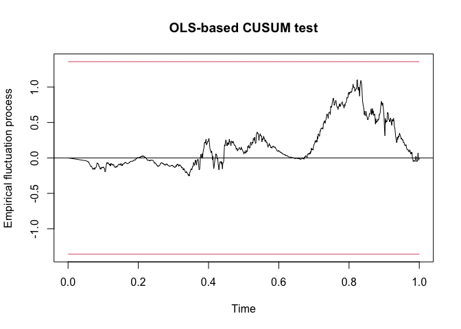

``` r
library(tidyverse)
library(MASS, exclude = "select")
library(here)
library(zoo)
library(vars)
library(tseries)
library(ggplot2)
library(lubridate)
```

The data is from the
[CDC](https://data.cdc.gov/Case-Surveillance/United-States-COVID-19-Cases-and-Deaths-by-State-o/9mfq-cb36/data).
Note: New York City is tabulated separately from New York State.

``` r
df <- read.csv(here("data/United_States_COVID-19_Cases_and_Deaths_by_State_over_Time.csv")) %>%
  select(submission_date, state, new_case)
head(df) 
```

    ##   submission_date state new_case
    ## 1      12/01/2021    ND      589
    ## 2      12/10/2020    WA     3018
    ## 3      08/17/2020    MD      503
    ## 4      03/28/2022    VT      467
    ## 5      03/18/2020    ME       12
    ## 6      02/06/2020    NE        0

For simplicity, start with a subset of northeastern states, with counts
by month starting in March 2020. We will look at Covid cases instead of
deaths.

``` r
# make table of states/regions
states <- data.frame(state.name, state.abb)
northeast_states_df <- states %>%
  filter(state.region == "Northeast")
northeast_states <- northeast_states_df %>%
  select(state.abb) %>%
  rename("state" = "state.abb") %>%
  pull(state)

northeast_states <- c(northeast_states, "NYC")

# make northeast df
northeast_df <- df %>%
  # select northeast states only
  filter(state %in% northeast_states) %>%
  select(submission_date, new_case, state) %>%
  rename( "cases" = "new_case") %>%
  mutate(date = mdy(submission_date)) %>%
  select(state, cases, date) %>%
  group_by(date, state) %>%
  # calculate cases by month
  summarize(cases = sum(cases), .groups = "drop") %>%
  pivot_wider(names_from = state, values_from = cases) 
```

Next we convert to a time series object.

``` r
# make each individual state a time series
ts_list <- lapply(X = setNames(northeast_states, northeast_states), FUN =  function(x) {
  state_ts <- ts(northeast_df[[x]], 
        frequency = 1)
  state_ts
})

# merge time series together into one time series object/matrix
var_data <- do.call(ts.union, ts_list)
```

Next we calculate a correlation between states. I get errors later about
singularity and positive definite. So, I calculate the correlation
matrix and take the determinant, and find that it is treated as zero by
machine precision.

``` r
cor_matrix <- round(cor(var_data), 3)
cor_matrix
```

    ##        CT    ME    MA    NH    NJ    NY    PA    RI    VT   NYC
    ## CT  1.000 0.571 0.763 0.650 0.548 0.516 0.561 0.563 0.330 0.365
    ## ME  0.571 1.000 0.702 0.637 0.696 0.737 0.830 0.827 0.580 0.366
    ## MA  0.763 0.702 1.000 0.874 0.654 0.619 0.658 0.675 0.674 0.351
    ## NH  0.650 0.637 0.874 1.000 0.424 0.436 0.514 0.494 0.730 0.255
    ## NJ  0.548 0.696 0.654 0.424 1.000 0.943 0.881 0.905 0.481 0.625
    ## NY  0.516 0.737 0.619 0.436 0.943 1.000 0.909 0.904 0.503 0.638
    ## PA  0.561 0.830 0.658 0.514 0.881 0.909 1.000 0.933 0.496 0.532
    ## RI  0.563 0.827 0.675 0.494 0.905 0.904 0.933 1.000 0.531 0.558
    ## VT  0.330 0.580 0.674 0.730 0.481 0.503 0.496 0.531 1.000 0.303
    ## NYC 0.365 0.366 0.351 0.255 0.625 0.638 0.532 0.558 0.303 1.000

I use `VARselect` to see the information criteria for different lags. I
choose 10.

``` r
VARselect(var_data)
```

    ## $selection
    ## AIC(n)  HQ(n)  SC(n) FPE(n) 
    ##     10     10      9     10 
    ## 
    ## $criteria
    ##                   1            2            3            4            5
    ## AIC(n) 1.308760e+02 1.291283e+02 1.275952e+02 1.266451e+02 1.256382e+02
    ## HQ(n)  1.311192e+02 1.295925e+02 1.282805e+02 1.275514e+02 1.267655e+02
    ## SC(n)  1.315096e+02 1.303379e+02 1.293807e+02 1.290066e+02 1.285757e+02
    ## FPE(n) 6.898456e+56 1.201632e+56 2.594576e+55 1.003798e+55 3.670289e+54
    ##                   6            7            8            9           10
    ## AIC(n) 1.241877e+02 1.227847e+02 1.215298e+02 1.206895e+02 1.202052e+02
    ## HQ(n)  1.255361e+02 1.243541e+02 1.233202e+02 1.227010e+02 1.224377e+02
    ## SC(n)  1.277011e+02 1.268741e+02 1.261951e+02 1.259308e+02 1.260225e+02
    ## FPE(n) 8.614918e+53 2.121468e+53 6.061192e+52 2.623203e+52 1.621763e+52

VAR does the estimation of VAR with OLS.

``` r
var_est <- VAR(y = var_data, p = 10)


# coefficients for each equation, CA example
summary <- summary(var_est)
summary$varresult$PA
```

    ## 
    ## Call:
    ## lm(formula = y ~ -1 + ., data = datamat)
    ## 
    ## Residuals:
    ##     Min      1Q  Median      3Q     Max 
    ## -3639.5  -261.9   -20.6   250.0  5282.2 
    ## 
    ## Coefficients:
    ##          Estimate Std. Error t value Pr(>|t|)    
    ## CT.l1    0.272958   0.052371   5.212 2.45e-07 ***
    ## ME.l1    1.288244   0.317813   4.053 5.60e-05 ***
    ## MA.l1   -0.016594   0.037711  -0.440 0.660052    
    ## NH.l1    0.196975   0.128314   1.535 0.125201    
    ## NJ.l1    0.229494   0.050417   4.552 6.25e-06 ***
    ## NY.l1    0.132226   0.035343   3.741 0.000198 ***
    ## PA.l1    0.170598   0.039984   4.267 2.25e-05 ***
    ## RI.l1    1.199279   0.318090   3.770 0.000177 ***
    ## VT.l1   -0.141056   0.208614  -0.676 0.499157    
    ## NYC.l1   0.080592   0.016750   4.811 1.83e-06 ***
    ## CT.l2    0.128097   0.058208   2.201 0.028078 *  
    ## ME.l2   -0.078407   0.330559  -0.237 0.812574    
    ## MA.l2    0.127786   0.039784   3.212 0.001377 ** 
    ## NH.l2   -0.070521   0.130890  -0.539 0.590204    
    ## NJ.l2   -0.040724   0.054020  -0.754 0.451174    
    ## NY.l2    0.031362   0.038614   0.812 0.416943    
    ## PA.l2    0.044628   0.039336   1.135 0.256946    
    ## RI.l2    0.111461   0.340458   0.327 0.743471    
    ## VT.l2   -1.141910   0.209425  -5.453 6.84e-08 ***
    ## NYC.l2   0.006160   0.019580   0.315 0.753174    
    ## CT.l3    0.049043   0.060938   0.805 0.421205    
    ## ME.l3   -0.344567   0.328139  -1.050 0.294043    
    ## MA.l3   -0.032773   0.039209  -0.836 0.403517    
    ## NH.l3    0.161108   0.127203   1.267 0.205732    
    ## NJ.l3    0.045354   0.054829   0.827 0.408409    
    ## NY.l3   -0.025142   0.039949  -0.629 0.529326    
    ## PA.l3    0.084466   0.037095   2.277 0.023077 *  
    ## RI.l3    0.023865   0.341140   0.070 0.944249    
    ## VT.l3    0.085369   0.211827   0.403 0.687059    
    ## NYC.l3  -0.079982   0.020199  -3.960 8.26e-05 ***
    ## CT.l4   -0.075354   0.056431  -1.335 0.182192    
    ## ME.l4    0.486106   0.311095   1.563 0.118596    
    ## MA.l4   -0.094407   0.036786  -2.566 0.010478 *  
    ## NH.l4    0.225706   0.125222   1.802 0.071895 .  
    ## NJ.l4   -0.124413   0.056014  -2.221 0.026656 *  
    ## NY.l4   -0.083715   0.041771  -2.004 0.045429 *  
    ## PA.l4    0.128585   0.038122   3.373 0.000784 ***
    ## RI.l4    0.285505   0.344336   0.829 0.407298    
    ## VT.l4   -0.214197   0.227251  -0.943 0.346227    
    ## NYC.l4  -0.030699   0.017065  -1.799 0.072450 .  
    ## CT.l5   -0.109190   0.054124  -2.017 0.044027 *  
    ## ME.l5   -0.955040   0.306136  -3.120 0.001883 ** 
    ## MA.l5   -0.088887   0.037015  -2.401 0.016589 *  
    ## NH.l5    0.099277   0.122851   0.808 0.419294    
    ## NJ.l5    0.064718   0.058177   1.112 0.266325    
    ## NY.l5   -0.031415   0.040307  -0.779 0.436009    
    ## PA.l5   -0.019189   0.038461  -0.499 0.617990    
    ## RI.l5   -0.291388   0.352296  -0.827 0.408450    
    ## VT.l5    0.080785   0.213339   0.379 0.705045    
    ## NYC.l5  -0.006764   0.016406  -0.412 0.680264    
    ## CT.l6   -0.136114   0.055933  -2.434 0.015196 *  
    ## ME.l6    0.655415   0.299347   2.189 0.028884 *  
    ## MA.l6    0.094544   0.037283   2.536 0.011428 *  
    ## NH.l6   -0.284926   0.123672  -2.304 0.021515 *  
    ## NJ.l6    0.024157   0.055346   0.436 0.662631    
    ## NY.l6    0.062072   0.041740   1.487 0.137423    
    ## PA.l6    0.183089   0.039742   4.607 4.84e-06 ***
    ## RI.l6    0.394654   0.357297   1.105 0.269724    
    ## VT.l6   -0.465187   0.212109  -2.193 0.028618 *  
    ## NYC.l6   0.051849   0.016676   3.109 0.001950 ** 
    ## CT.l7   -0.196765   0.057417  -3.427 0.000645 ***
    ## ME.l7   -0.066794   0.306095  -0.218 0.827326    
    ## MA.l7   -0.134081   0.037924  -3.536 0.000433 ***
    ## NH.l7    0.116076   0.125407   0.926 0.354967    
    ## NJ.l7    0.008135   0.055945   0.145 0.884433    
    ## NY.l7   -0.039128   0.043394  -0.902 0.367528    
    ## PA.l7    0.127558   0.039940   3.194 0.001466 ** 
    ## RI.l7    1.337096   0.359596   3.718 0.000216 ***
    ## VT.l7    1.238002   0.203783   6.075 2.01e-09 ***
    ## NYC.l7  -0.010950   0.017735  -0.617 0.537137    
    ## CT.l8   -0.041756   0.060339  -0.692 0.489145    
    ## ME.l8   -0.788098   0.317745  -2.480 0.013356 *  
    ## MA.l8   -0.006969   0.037676  -0.185 0.853312    
    ## NH.l8   -0.373279   0.127082  -2.937 0.003417 ** 
    ## NJ.l8   -0.203891   0.055981  -3.642 0.000290 ***
    ## NY.l8   -0.164820   0.043894  -3.755 0.000187 ***
    ## PA.l8    0.188015   0.040808   4.607 4.83e-06 ***
    ## RI.l8   -1.670440   0.356691  -4.683 3.38e-06 ***
    ## VT.l8    0.738715   0.211872   3.487 0.000519 ***
    ## NYC.l8   0.006995   0.021687   0.323 0.747139    
    ## CT.l9   -0.025706   0.058599  -0.439 0.661023    
    ## ME.l9    0.289696   0.325416   0.890 0.373640    
    ## MA.l9    0.028620   0.037276   0.768 0.442871    
    ## NH.l9   -0.174691   0.131637  -1.327 0.184911    
    ## NJ.l9    0.096066   0.055724   1.724 0.085145 .  
    ## NY.l9    0.144797   0.044558   3.250 0.001210 ** 
    ## PA.l9   -0.087916   0.043177  -2.036 0.042102 *  
    ## RI.l9    0.191802   0.348349   0.551 0.582077    
    ## VT.l9   -0.033824   0.214948  -0.157 0.875006    
    ## NYC.l9  -0.118717   0.021688  -5.474 6.09e-08 ***
    ## CT.l10  -0.074450   0.053192  -1.400 0.162049    
    ## ME.l10  -0.411711   0.296661  -1.388 0.165625    
    ## MA.l10  -0.019272   0.035558  -0.542 0.587997    
    ## NH.l10   0.037260   0.124100   0.300 0.764081    
    ## NJ.l10   0.077098   0.055549   1.388 0.165595    
    ## NY.l10  -0.029980   0.042009  -0.714 0.475667    
    ## PA.l10   0.106043   0.040787   2.600 0.009516 ** 
    ## RI.l10  -0.690185   0.304197  -2.269 0.023573 *  
    ## VT.l10   0.241889   0.218902   1.105 0.269525    
    ## NYC.l10  0.038017   0.023162   1.641 0.101171    
    ## const   20.557006  41.147752   0.500 0.617517    
    ## ---
    ## Signif. codes:  0 '***' 0.001 '**' 0.01 '*' 0.05 '.' 0.1 ' ' 1
    ## 
    ## Residual standard error: 758.6 on 716 degrees of freedom
    ## Multiple R-squared:  0.9766, Adjusted R-squared:  0.9734 
    ## F-statistic: 299.5 on 100 and 716 DF,  p-value: < 2.2e-16

Next we run Phillips-Perron Unit Root Test, which tests the stationarity
assumption. The results of the test suggest that the data is stationary,
if we hold significance at the 0.1 level.

``` r
pp_test <- lapply(ts_list, pp.test)

lapply(pp_test, "[[", "p.value") %>%
  as.data.frame() %>%
  pivot_longer(everything(), names_to = c("state"), values_to = "p.value") %>%
  mutate(p.value = round(p.value, 3))
```

    ## # A tibble: 10 × 2
    ##    state p.value
    ##    <chr>   <dbl>
    ##  1 CT      0.01 
    ##  2 ME      0.01 
    ##  3 MA      0.01 
    ##  4 NH      0.01 
    ##  5 NJ      0.057
    ##  6 NY      0.01 
    ##  7 PA      0.017
    ##  8 RI      0.04 
    ##  9 VT      0.01 
    ## 10 NYC     0.01

The stability function checks for structural breaks. Structural breaks
may impact the estimation. The line in the middle of the plot should not
go outside of the red bounds.

``` r
stability <- stability(var_est, type = "OLS-CUSUM")

# connecticut for example
stability$stability$PA
```

    ## 
    ## Empirical Fluctuation Process: OLS-based CUSUM test 
    ## 
    ## Call: efp(formula = formula, data = data, type = type, h = h, dynamic = dynamic, 
    ##     rescale = rescale)

``` r
plot(stability$stability$PA)
```



`serial.test()` computes the multivariate Portmanteau- and
Breusch-Godfrey test for serially correlated errors. This checks the
assumption that the residuals should be non-autocorrelated. The null
hypothesis is that there is no serial correlation (need to check this).
So we conclude, that there is serial correlation in this data.

``` r
serial.test(var_est, type = "PT.asymptotic")
```

    ## 
    ##  Portmanteau Test (asymptotic)
    ## 
    ## data:  Residuals of VAR object var_est
    ## Chi-squared = 2576.1, df = 600, p-value < 2.2e-16

`arch.test()` this computes the ARCH(autoregressive conditionally
heteroscedastic)-LM test, which analyzes volatility variance. Need to
check what the null is for this test.

``` r
arch.test(var_est, 
          multivariate.only = TRUE)
```

    ## 
    ##  ARCH (multivariate)
    ## 
    ## data:  Residuals of VAR object var_est
    ## Chi-squared = 32388, df = 15125, p-value < 2.2e-16

`causality()` computes Granger- and Instantaneous causality. Granger
causality tests if one time series is useful for forecasting another. We
would say that Pensylvaina does Granger-cause COVID cases in other
states.

``` r
causality(var_est, cause = "PA")
```

    ## $Granger
    ## 
    ##  Granger causality H0: PA do not Granger-cause CT ME MA NH NJ NY RI VT
    ##  NYC
    ## 
    ## data:  VAR object var_est
    ## F-Test = 7.2901, df1 = 90, df2 = 7160, p-value < 2.2e-16
    ## 
    ## 
    ## $Instant
    ## 
    ##  H0: No instantaneous causality between: PA and CT ME MA NH NJ NY RI VT
    ##  NYC
    ## 
    ## data:  VAR object var_est
    ## Chi-squared = 118.94, df = 9, p-value < 2.2e-16

`normality.test()` checks for normality of the distribution of the
residuals. It’s not clear what the null/alternative hypothesis is. I
think it is that the null hypothesis is that the distribution is normal,
so we would conclude that the residuals are not normal.

``` r
normality.test(var_est, multivariate.only = TRUE)
```

    ## $JB
    ## 
    ##  JB-Test (multivariate)
    ## 
    ## data:  Residuals of VAR object var_est
    ## Chi-squared = 161724, df = 20, p-value < 2.2e-16
    ## 
    ## 
    ## $Skewness
    ## 
    ##  Skewness only (multivariate)
    ## 
    ## data:  Residuals of VAR object var_est
    ## Chi-squared = 1596.7, df = 10, p-value < 2.2e-16
    ## 
    ## 
    ## $Kurtosis
    ## 
    ##  Kurtosis only (multivariate)
    ## 
    ## data:  Residuals of VAR object var_est
    ## Chi-squared = 160127, df = 10, p-value < 2.2e-16

`irf()` computes the impulse response coefficients. It is not clear to
my why we would need this.

``` r
irf(var_est, impulse = "PA", response = "MA", n.ahead = 20, boot = TRUE)
```

`fevd()` computes the forecast error variance decomposition. It tells
which states influence the variance the most over time.

``` r
fevd_out <- fevd(var_est)
fevd_out$PA
```

    ##               CT         ME         MA           NH         NJ          NY
    ##  [1,] 0.01148402 0.01649506 0.02730494 1.163737e-05 0.06439716 0.005557831
    ##  [2,] 0.06906090 0.07095687 0.02124941 2.632356e-03 0.08117187 0.043546974
    ##  [3,] 0.10785387 0.09056479 0.01777030 3.845892e-03 0.07630046 0.052706496
    ##  [4,] 0.10660395 0.09530283 0.01601631 7.397811e-03 0.08717194 0.050911628
    ##  [5,] 0.09635366 0.11110488 0.02786308 1.974502e-02 0.08231151 0.059187495
    ##  [6,] 0.09461841 0.10741683 0.02731142 2.293581e-02 0.09892721 0.063965224
    ##  [7,] 0.08832039 0.10604933 0.02771691 2.070701e-02 0.12209329 0.061534740
    ##  [8,] 0.07725132 0.11559489 0.02229780 2.361312e-02 0.17687634 0.061889182
    ##  [9,] 0.08459277 0.11140581 0.02075071 2.260756e-02 0.19059017 0.086392183
    ## [10,] 0.08421554 0.11858798 0.01777269 3.310583e-02 0.20399095 0.096588951
    ##              PA         RI           VT        NYC
    ##  [1,] 0.8747493 0.00000000 0.0000000000 0.00000000
    ##  [2,] 0.6678364 0.02053826 0.0007373295 0.02226961
    ##  [3,] 0.5529565 0.04747619 0.0063605466 0.04416499
    ##  [4,] 0.4995853 0.07532213 0.0173176197 0.04437050
    ##  [5,] 0.4510463 0.09300973 0.0158392884 0.04353903
    ##  [6,] 0.4358019 0.09047621 0.0152992729 0.04324773
    ##  [7,] 0.3935290 0.09511356 0.0259442048 0.05899154
    ##  [8,] 0.3192203 0.11180033 0.0325199227 0.05893681
    ##  [9,] 0.2834735 0.09775039 0.0332097163 0.06922723
    ## [10,] 0.2446420 0.08732232 0.0298633677 0.08391037
